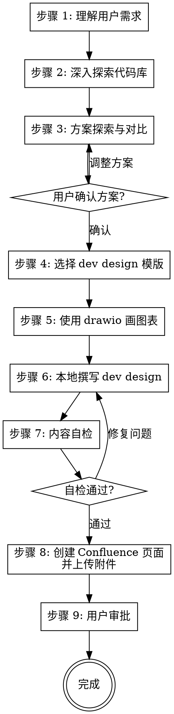

# Dev Design 工作流

结合代码库，参照 Dev Design 模版，以 [Confluence Storage Format](https://confluence.atlassian.com/doc/confluence-storage-format-790796544.html) 格式（基于 XHTML）撰写 dev design，并保存到 Confluence。

<HARD-GATE>
在方案探索（步骤 3）完成并获得用户确认前，禁止开始撰写 dev design 正文。
在内容自检（步骤 7）通过前，禁止将 dev design 发布到 Confluence。
这两条规则适用于所有需求，无论看起来多"简单"。
</HARD-GATE>

## 工作流程

- [ ] 步骤 1：理解用户需求
- [ ] 步骤 2：深入探索代码库
- [ ] 步骤 3：方案探索与对比
- [ ] 步骤 4：选择合适的 dev design 模版
- [ ] 步骤 5：使用 drawio 画图表
- [ ] 步骤 6：本地撰写 dev design
- [ ] 步骤 7：内容自检
- [ ] 步骤 8：创建 Confluence 页面并上传附件
- [ ] 步骤 9：用户审批

## 流程图



## 各步骤详细说明

### 步骤 1：理解用户需求

如果用户提及了任何 Kaptain 事项，需要查询该事项详情。使用 `qunhe-kaptain-mcp` MCP 工具（如 `mcp__qunhe-kaptain-mcp__get_issue_detail`）查询。

如果该工具不可用，提示用户参照 [Kaptain MCP 安装指南](https://cf.qunhequnhe.com/pages/viewpage.action?pageId=81420377274) 安装 Kaptain MCP，然后再继续。

如果该事项存在关联文档，则继续获取关联文档内容：

```bash
confluence pages get <pageIdOrUrl> --format markdown --body-only
```

如用户未提及任何敏捷事项，则用户输入即为需求本身。

**本步骤的输出：** 对需求的清晰理解，包括目标、约束和成功标准

### 步骤 2：深入探索代码库

根据用户需求，深入探索代码库，检查是否有与当前需求有关联的业务逻辑。

此外，你还需要判断当前仓库为前端仓库还是后端仓库，此判断结果将用于后续步骤选择模版和撰写内容。

**本步骤的输出：** 代码库现状分析，包括相关模块、依赖关系、现有实现，以及前端/后端的判断结论

### 步骤 3：方案探索与对比

基于对需求和代码库的理解，提出 2-3 个可行的技术方案，并进行对比分析：

- 每个方案需说明：核心思路、优势、劣势、风险
- 给出你的推荐方案及推荐理由
- 以对话形式呈现，让用户能够快速理解和选择

当需求非常明确且只有唯一合理实现路径时，可以跳过方案对比，但仍需向用户说明唯一方案并获得确认后才能进入步骤 4。

**GATE 1：** 用户确认技术方案后，方可进入下一步。如果用户对方案有异议，需调整后重新确认。

### 步骤 4：选择合适的 dev design 模版

根据步骤 2 的判断结果，选择对应的 dev design 模版，学习并理解行文结构：

- [前端 Dev Design 模版](templates/frontend-dev-design.html) 
- [后端 Dev Design 模版](templates/backend-dev-design.html)

### 步骤 5：使用 drawio 画图表

为了丰富 dev design 可读性，你可以使用 drawio 画一些流程图/架构图/时序图/UML 等图表。

将 drawio xml 内容写入到本地文件（例如当前工作目录 `.confluence-mcp-temp/some.drawio`）。

由于上传附件需要 pageId，因此当前步骤暂时不上传附件。需要等到页面创建完得到 pageId 后再上传。

### 步骤 6：本地撰写 dev design

参考步骤 4 选定的 dev design 模版，撰写具体的正文内容。

输出 html 文件名路径为 `.confluence-mcp-temp/<issue-key-or-id>.html`，如果用户未提及任务号，则自动生成一个描述性的 .html 文件名。

严格参照 Dev Design 模版的目录结构生成 Confluence Storage Format 格式（基于 XHTML）的 Dev Design：

- 禁止调整内容目录结构，严格参照 Dev Design 模版的目录结构编写内容
- 不要包含 `<html>`、`<head>`、`<body>` 等外层标签
- 合理组织内容层次，让读者能够快速定位关键信息
- 积极使用 Confluence 宏以提升可读性，可用宏列表和示例代码见 [macros.md](macros.md)

以下是一些最佳实践：

- 使用 `code` 宏展示所有代码片段，指定正确的语言类型
- 使用 `drawio` 宏绘制架构图、流程图、时序图等，使技术方案更直观
- 使用 `status` 宏标记任务状态、里程碑等
- 使用 `task-list` 宏列出待办事项或实施步骤

如果步骤 5 画了一些 drawio 图表，使用 drawio 宏将图表嵌入到页面：

```xml
<ac:structured-macro ac:name="drawio" ac:schema-version="1">
  <ac:parameter ac:name="border">true</ac:parameter>
  <ac:parameter ac:name="diagramName">test.drawio</ac:parameter>
  <ac:parameter ac:name="simpleViewer">false</ac:parameter>
  <ac:parameter ac:name="links">auto</ac:parameter>
  <ac:parameter ac:name="tbstyle">top</ac:parameter>
  <ac:parameter ac:name="lbox">true</ac:parameter>
  <ac:parameter ac:name="diagramWidth">auto</ac:parameter>
  <ac:parameter ac:name="revision">1</ac:parameter>
</ac:structured-macro>
```

`diagramName` 为步骤 5 的图表文件名，`revision` 固定为 `1`（首次上传）。

### 步骤 7：内容自检

撰写完成后，必须执行以下 4 项自检，发现问题则直接修复：

1. **占位符扫描** — 检查是否有 "TBD"、"TODO"、空白章节、模糊描述。如有，补充具体内容
2. **内部一致性** — 检查各章节之间是否存在矛盾。例如：架构说明与详细设计是否一致，接口设计与数据结构是否匹配
3. **范围检查** — 检查内容是否聚焦于当前需求，是否引入了不必要的额外功能
4. **Confluence 格式检查** — 检查是否包含禁止的 emoji 字符、是否有外层 HTML 标签、宏语法是否正确

**GATE 2：** 自检全部通过后，方可发布到 Confluence。如有问题，回到步骤 6 修复后重新自检。

### 步骤 8：创建 Confluence 页面并上传附件

询问用户需要创建到哪个父页面下，然后查询父页面信息：

```bash
confluence pages get <parentPage> --metadata-only
```

创建页面：

```bash
confluence pages create <parentPage> --title "页面标题" --file .confluence-mcp-temp/<filename>.html
```

为创建的页面添加 "devdesign" 标签：

```bash
confluence pages label <pageId> devdesign
```

如果步骤 5 生成了 drawio 文件，上传为页面附件：

```bash
confluence attachments upload <pageId> .confluence-mcp-temp/<name>.drawio -y
```

### 步骤 9：用户审批

发布到 Confluence 后，提示用户进行 review：

> "Dev design 已发布到 Confluence: `<页面链接>`。请 review 内容，如有需要修改的地方请告诉我。"

如果用户提出修改意见，回到步骤 6 修改本地文件，重新执行步骤 7-8。

## 反模式提醒

以下想法意味着你可能在走捷径，请停下来重新审视：

| 想法 | 实际情况 |
|------|----------|
| "需求很简单，不需要方案对比" | 简单需求往往隐藏未被发现的假设，至少说明为什么只有一种方案 |
| "先写 dev design 再想方案" | 没有经过方案确认的 dev design 可能方向就是错的 |
| "自检太繁琐，代码已经很清楚了" | 自检是为了确保文档的读者能理解，而不仅仅是你能理解 |
| "先发 Confluence 再修改" | 未经自检的内容发布后可能包含占位符或矛盾，影响团队信任 |
| "模版某个章节不需要" | 严格遵循模版结构，不需要的章节标注"不涉及"即可 |
| "Confluence 宏太复杂，纯文本就行" | 宏显著提升可读性，是 dev design 质量的重要组成部分 |

## 核心原则

- **先想后写** — 理解需求和探索方案在前，动笔撰写在后
- **渐进确认** — 方案确认、自检通过、用户审批，层层把关
- **严格遵循模版** — 不遗漏章节，不调整结构，不需要的章节标注"不涉及"
- **善用 Confluence 宏** — code、drawio、status、task-list 等宏让文档更专业
- **聚焦当前需求** — 不引入无关的设计内容，不过度设计

## 注意事项

- 除非用户确认，否则禁止修改代码
- 禁止使用 emoji 字符：Confluence 不支持 emoji
