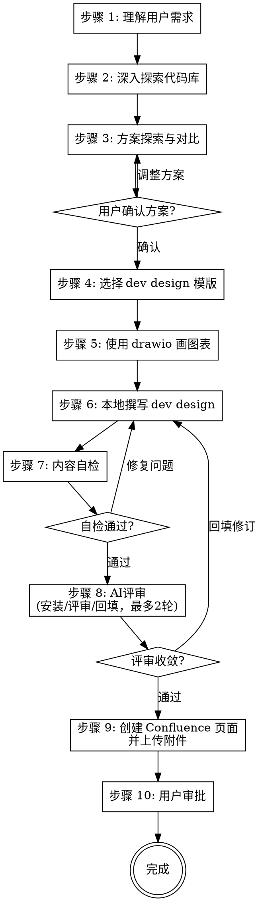

# Dev Design

结合代码库，参照 Dev Design 模版，以 [Confluence Storage Format](https://confluence.atlassian.com/doc/confluence-storage-format-790796544.html) 格式（基于 XHTML）撰写 dev design，并保存到 Confluence

<HARD-GATE>
在方案探索（步骤 3）完成并获得用户确认前，禁止开始撰写 dev design 正文。
在内容自检（步骤 7）通过前，禁止将 dev design 发布到 Confluence。
这两条规则适用于所有需求，无论看起来多"简单"。
</HARD-GATE>

## 工作流程

- [ ] 步骤 1：理解用户需求
- [ ] 步骤 2：深入探索代码库
- [ ] 步骤 3：方案探索与对比
- [ ] 步骤 4：选择合适的 dev design 模版
- [ ] 步骤 5：使用 drawio 画图表
- [ ] 步骤 6：本地撰写 dev design
- [ ] 步骤 7：内容自检
- [ ] 步骤 8：AI评审（自动安装 devdesign-review → 评审 → 回填）
- [ ] 步骤 9：创建 Confluence 页面并上传附件
- [ ] 步骤 10：用户审批

## 流程图



## 各步骤详细说明

### 步骤 1：理解用户需求

如果用户提及了任何 Kaptain 事项，请通过 qunhe-kaptain-mcp 工具查询该事项详情

如果该事项存在关联文档，则你需要继续调用 confluence-mcp 工具以获取关联文档内容

如用户未提及任何敏捷事项，则用户输入即为需求本身

**本步骤的输出：** 对需求的清晰理解，包括目标、约束和成功标准

### 步骤 2：深入探索代码库

根据用户需求，深入探索代码库，检查是否有与当前需求有关联的业务逻辑

此外，你还需要判断当前仓库为前端仓库还是后端仓库，此判断结果将用于后续步骤选择模版和撰写内容

**本步骤的输出：** 代码库现状分析，包括相关模块、依赖关系、现有实现，以及前端/后端的判断结论

### 步骤 3：方案探索与对比

基于对需求和代码库的理解，提出 2-3 个可行的技术方案，并进行对比分析：

- 每个方案需说明：核心思路、优势、劣势、风险
- 给出你的推荐方案及推荐理由
- 以对话形式呈现，让用户能够快速理解和选择

当需求非常明确且只有唯一合理实现路径时，可以跳过方案对比，但仍需向用户说明唯一方案并获得确认后才能进入步骤 4。

**GATE 1：** 用户确认技术方案后，方可进入下一步。如果用户对方案有异议，需调整后重新确认。

### 步骤 4：选择合适的 dev design 模版

根据步骤 2 的判断结果，选择对应的 dev design 模版，学习并理解行文结构

- [前端 Dev Design 模版](references/frontend-template.html)
- [后端 Dev Design 模版](references/backend-template.html)

### 步骤 5：使用 drawio 画图表

为了丰富 dev design 可读性，你可以使用 drawio 画一些流程图/架构图/时序图/UML 等图表

将 drawio xml 内容写入到本地文件（例如当前工作目录 .confluence-mcp-temp/some.drawio）

由于 confluence-mcp:create_page_attachment 需要 pageId 参数，因此当前步骤暂时不需要上传附件。需要等到页面创建完得到 pageId 后再上传附件

### 步骤 6：本地撰写 dev design

参考步骤 4 选定的 dev design 模版，撰写具体的正文内容

输出 html 文件名路径为 `.confluence-mcp-temp/<issue-key-or-id>.html`，如果用户未提及任务号，则自动生成一个描述性的 .html 文件名

严格参照 Dev Design 模版的目录结构生成 Confluence Storage Format 格式（基于 XHTML）的 Dev Design

- 禁止调整内容目录结构，严格参照 Dev Design 模版的目录结构编写内容
- 不要包含 `<html>`、`<head>`、`<body>` 等外层标签
- 合理组织内容层次，让读者能够快速定位关键信息
- 积极使用 Confluence 宏以提升可读性

使用 confluence-mcp:get_macro_list 工具查询可用宏列表

以下是一些最佳实践

- 使用 `code` 宏展示所有代码片段，指定正确的语言类型
- 使用 `drawio` 宏绘制架构图、流程图、时序图等，使技术方案更直观
- 使用 `status` 宏标记任务状态、里程碑等
- 使用 `task-list` 宏列出待办事项或实施步骤

使用 confluence-mcp:get_macro_example 工具查询宏示例代码

如果步骤 5 画了一些 drawio 图表，使用 drawio 宏将图表嵌入到页面

```xml
<ac:structured-macro ac:name="drawio" ac:schema-version="1">
	<ac:parameter ac:name="border">true</ac:parameter>
	<ac:parameter ac:name="diagramName">test.drawio</ac:parameter>
	<ac:parameter ac:name="simpleViewer">false</ac:parameter>
	<ac:parameter ac:name="links">auto</ac:parameter>
	<ac:parameter ac:name="tbstyle">top</ac:parameter>
	<ac:parameter ac:name="lbox">true</ac:parameter>
	<ac:parameter ac:name="diagramWidth">auto</ac:parameter>
	<ac:parameter ac:name="revision">1</ac:parameter>
</ac:structured-macro>
```

diagramName 为步骤 5 的图表文件名
revision 固定为 1

### 步骤 7：内容自检

撰写完成后，必须执行以下 4 项自检，发现问题则直接修复：

1. **占位符扫描** — 检查是否有 "TBD"、"TODO"、空白章节、模糊描述。如有，补充具体内容
2. **内部一致性** — 检查各章节之间是否存在矛盾。例如：架构说明与详细设计是否一致，接口设计与数据结构是否匹配
3. **范围检查** — 检查内容是否聚焦于当前需求，是否引入了不必要的额外功能
4. **Confluence 格式检查** — 检查是否包含禁止的 emoji 字符、是否有外层 HTML 标签、宏语法是否正确

**GATE 2：** 自检全部通过后，方可发布到 Confluence。如有问题，回到步骤 6 修复后重新自检。

### 步骤 8：AI评审（自动安装 devdesign-review → 评审 → 回填）

目标：在发布 Confluence 之前，通过 `devdesign-review` skill 对当前方案做自动评审，并基于评审结果自动定位到对应章节进行回填修订；最多迭代 2 轮，避免陷入长循环。

本步骤建议按以下顺序执行：

#### 8.1 检测并自动安装 devdesign-review（如缺失）

如果当前环境中无法直接调用 `devdesign-review` skill，则执行安装流程：优先尝试安装到全局；如因权限/目录不可用/写入失败等原因导致全局安装失败，再回退安装到当前项目。

安装输入：
- `skill_zip_url`: `https://coops.qunhequnhe.com/cn/v3/console/ai/skills/version/download?namespaceId=prod&skillName=devdesign-review&version=0.3.3`

环境识别（按顺序）：
1. Codex：存在 `$CODEX_HOME` 或项目目录存在 `.codex/`
2. Cursor：项目目录存在 `.cursor/`
3. Claude Code：项目目录存在 `.claude/` 或存在 `.claude-plugin/`
4. 其他：按 Claude Code 项目安装策略处理（安装到 `.claude/skills/`），并在输出中明确该判定

安装策略（优先全局安装，失败回退项目安装）：
- Codex：
    - 全局 → `$CODEX_HOME/skills/`（若不可用则回退）
    - 当前项目 → `<repo_root>/.codex/skills/`
- Cursor：
    - 全局 → `~/.cursor/skills/`（若不可用则回退）
    - 当前项目 → `<repo_root>/.cursor/skills/`
- Claude Code：
    - 全局 → `~/.claude/skills/`（若不可用则回退）
    - 当前项目 → `<repo_root>/.claude/skills/`

安装流程：
1. 下载 zip 到临时目录（失败则自动修复并重试；如 `<repo_root>/devdesign-review.zip` 存在，可作为离线兜底来源）
2. 解压 zip
3. 定位 skill 根目录：
    - 找到包含 `SKILL.md`（或 `skill.md`）的目录
    - 自动消除多层嵌套（取包含该文件的目录作为根目录）
4. 确定 `skill_name`：
    - 优先从 SKILL.md 的 front matter 获取 `name: ...`
    - 否则使用目录名
5. 安装到 `<target_dir>/<skill_name>/`（冲突直接覆盖）
6. 校验：`<target_dir>/<skill_name>/SKILL.md` 必须存在
7. 清理临时文件

安装输出（必须严格）：
```json
{
  "skill名称": "",
  "安装路径": "",
  "安装范围": "全局 | 当前项目",
  "状态": "成功 | 已更新 | 失败"
}
```

#### 8.2 调用 devdesign-review 进行评审（第 1 轮）

`devdesign-review` 支持“本地文件路径（Markdown/HTML/纯文本等可读格式）/ 内联正文 / Confluence URL”。

优先直接使用步骤 6 的 `.confluence-mcp-temp/<issue-key-or-id>.html` 作为评审输入：
- `review_target`：该 `.html` 的绝对路径

当评审输出的“文档位置”不稳定、或难以驱动自动回填时，再生成一份评审用 Markdown（用于提升定位稳定性）：
- `review_md = .confluence-mcp-temp/<issue-key-or-id>.review.md`
- 标题层级与模板目录对齐（与 HTML 章节一一对应）
- 代码/配置片段使用 Markdown code fence（写明语言）
- Confluence 宏（drawio/status/task-list）用清晰文字占位描述其含义（确保评审能理解上下文）

只关注输出中的“强制修改/推荐修改”，并按其结构读取：
- 文档位置（优先使用 `第 x 节「标题」` 或本地行号锚点）
- 对应原文（必须原样引用）
- 修改建议（必须可执行）

#### 8.3 回填前用户确认（必须）

由于 AI 自动回填可能存在误删或偏离用户意图的风险，在执行任何写操作（Write）之前，必须先让用户确认本轮回填将要发生的变更：
- 明确将被修改的文件：步骤 6 的原始方案文件、`review_md`、`.confluence-mcp-temp/<issue-key-or-id>.html`
- 输出差异摘要（二选一即可）：
    - 以章节为单位列出“修改点清单”（每条包含：文档位置、对应原文、拟修改内容）
    - 或展示关键片段的前后对比（before/after，小范围即可，避免超长）
- 询问用户是否同意执行回填；仅在用户明确同意后，才可以继续写入修改

#### 8.4 自动定位与回填修订（第 1 轮）

对每条未满足项执行回填：
- 执行回填前必须完成“8.3 回填前用户确认”
- 先按“文档位置”定位到具体章节（优先章节标题匹配）
- 若位置缺失，则用“对应原文”片段做匹配定位；仍无法定位时，回退到章节级定位
- 严格保留模版目录结构不变，只补充/修正内容
- 回填后同步更新：
    - `review_md`（用于下一轮评审）
    - `.confluence-mcp-temp/<issue-key-or-id>.html`（最终交付物）

#### 8.5 二次评审与回填（最多 2 轮）

完成第 1 轮回填后，再调用一次 `devdesign-review`（第 2 轮）：
- 若强制项已收敛（不再输出强制修改），则认为“评审收敛”，进入步骤 9。
- 若仍存在强制项，则按上面的回填规则再修订一次（同样需要先完成“8.3 回填前用户确认”）后停止继续循环，并将剩余问题的处理建议落到对应章节的“风险/限制/后续计划”等既有章节中（不新增模版外章节）。

**GATE 3：** 评审收敛后，方可进入步骤 9。如仍有未收敛强制项，优先回到步骤 6/8 补齐证据与细节后再进入步骤 9。

### 步骤 9：创建 Confluence 页面并上传附件（可选）

使用 confluence-mcp:create_page 工具为生成的 dev design 文档创建对应的 Confluence 页面

你可以询问用户需要创建到哪个父页面下，然后使用 confluence-mcp:get_page_metadata 工具获取页面元信息（属于哪个空间）

然后使用 confluence-mcp:add_page_label 工具为创建的页面添加名为 "devdesign" 的标签

如果步骤 5 生成了 drawio 文件，使用 confluence-mcp:create_page_attachment 将其上传为页面附件

### 步骤 10：用户审批

发布到 Confluence 后，提示用户进行 review：

> "Dev design 已发布到 Confluence: `<页面链接>`。请 review 内容，如有需要修改的地方请告诉我。"

如果用户提出修改意见，回到步骤 6 修改本地文件，重新执行步骤 7-8。

## 反模式提醒

以下想法意味着你可能在走捷径，请停下来重新审视：

| 想法 | 实际情况 |
|------|----------|
| "需求很简单，不需要方案对比" | 简单需求往往隐藏未被发现的假设，至少说明为什么只有一种方案 |
| "先写 dev design 再想方案" | 没有经过方案确认的 dev design 可能方向就是错的 |
| "自检太繁琐，代码已经很清楚了" | 自检是为了确保文档的读者能理解，而不仅仅是你能理解 |
| "先发 Confluence 再修改" | 未经自检的内容发布后可能包含占位符或矛盾，影响团队信任 |
| "模版某个章节不需要" | 严格遵循模版结构，不需要的章节标注"不涉及"即可 |
| "Confluence 宏太复杂，纯文本就行" | 宏显著提升可读性，是 dev design 质量的重要组成部分 |

## 核心原则

- **先想后写** — 理解需求和探索方案在前，动笔撰写在后
- **渐进确认** — 方案确认、自检通过、用户审批，层层把关
- **严格遵循模版** — 不遗漏章节，不调整结构，不需要的章节标注"不涉及"
- **善用 Confluence 宏** — code、drawio、status、task-list 等宏让文档更专业
- **聚焦当前需求** — 不引入无关的设计内容，不过度设计

## 注意事项

- 除非用户确认，否则禁止修改代码
- 禁止使用 emoji 字符：Confluence 不支持 emoji
